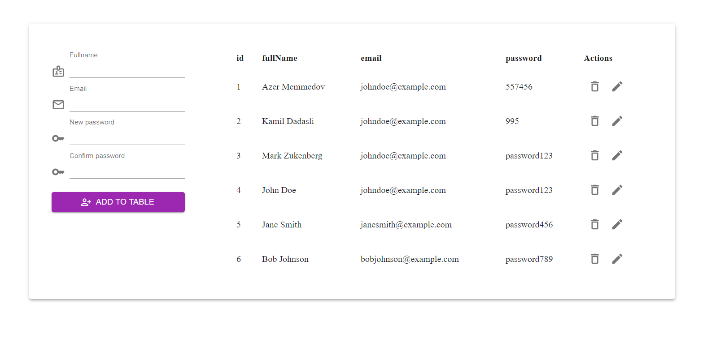

User table app
> reactSimpleTable


 ## [Demo](https://react-simple-table-azure.vercel.app/)



## Tools


A simple User Table App that allows you to create a table of user information. The app includes built-in validation to ensure that all fields are filled out correctly before the user's data is saved.


## Development setup

```sh
npm install
npm run dev
```
Local:   http://localhost:5173/

➜  press h to show help

  Shortcuts
 - press r to restart the server
 - press u to show server url
 - press o to open in browser
 - press c to clear console
 - press q to quit

## Meta

 Nijat Gurbanov

- Github: [github.com/NikoFX](https://github.com/NikoFX)
- Twitter: [Nijat Gurbanov](https://twitter.com/)
- Linkedin: [linkedin.com/in/nijat-gurbanov-dev](https://www.linkedin.com/in/nijat-gurbanov-dev/)

## Contributing

1. Fork it
2. Create your feature branch (`git checkout -b feature/fooBar`)
3. Commit your changes (`git commit -am 'Add some fooBar'`)
4. Push to the branch (`git push origin feature/fooBar`)
5. Create a new Pull Request
